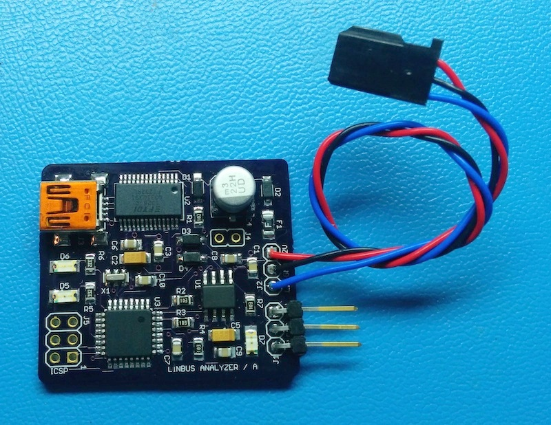

Arduino LINBUS Analyzer
=======================

The Arduino Linbus analyzer is a small Arduino based board that connects to a LIN bus on one end and to a computer USB port on the other. The Analyzer decods the frames on the LIN bus and send them to the computer as human readable text over virtual serial port (115.2kbs, 8 data bit, 1 start bit, 1 stop bit, no parity).

The board has two 3 pin LIN bus parallel connections such that one can be connected to the master and the other to the slave. The USB/Serial port is FTDI based and should be compatible with Mac OSX, Linux and Windows.

The USB/Serial port is also compatible with the Arduino IDE (emulating an Arduino Mini Pro 16Mhz 5V with Atmega328p) which can be used to edit/compile/download software updates. 

The output of the analyzer can be viewed directly with a terminal emulation software or using the provided script that ads timestamp and bit by bit diff capabilities (see .

The analyzer is hard coded to decode buss signals at 19,200bps and LIN bus enhanced checksum (V2). This can change in the source code (use the Arduino IDE) and downloaded to the Analyzer.

**Connectors**

J1 - LIN bus connection to the master.

J2 - LIN bus connection to the slave (connected 1:1 to J1)

J3 - FTDI Serial over USB connection to the computer.

J4 - Master mode jumper. Not used. Leave opened.

J5 - ICSP port. Used for one time programming of the Arduino bootloader in production.

**LED indicators**

D5 - Errors LED. Blinks when the analyzer detects LIN bus errors.

D6 - Frame LED, blinks when valid LIN bus frames are detected. Also blinks slow in idle state to indicates that the board is alive.

D7 - Power indicator. On when the board is powered, from the LIN bus or from the USB port.

