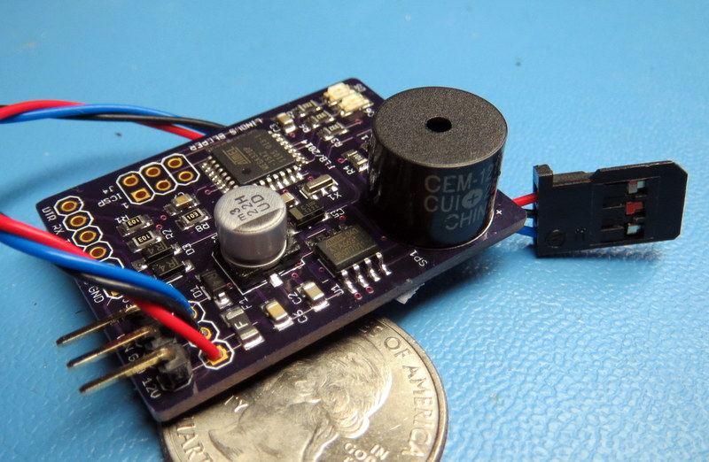
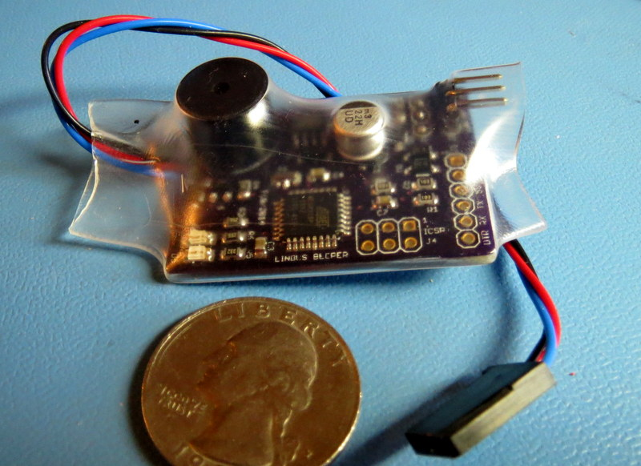

ARDUINO LINBUS BEEPR
====================

The Linbus Beeper is a small board (1.15" x 1.57") that is attached
to a linbus signal of a car and sounds a beep when certain conditions
are met.

The application specific logic is included in the car_module* files. The 
logic in the sample files here matches my car and acts as a reverse
gear audio indicator. It can be changed to adapt to other systems and 
applciation.

To change the code, use a standard Arduino IDE, connect the board to
the computer using a FTDI Basic breakout board (available from Sparkfun
and others). The board looks to the Arduino IDE as a Pro Mini 5V 16Mhz
Atmega328 board.

-----

The firmware decodes the lin frames using bit banging and timer's interrupts. To 
avoid jitter due to disabling interrupts, all other interrupts are disabled.
Also, the main loop() does not use blocking functions such as delay() and iterates
'fast' to allow efficient polling.

-----

The sample car logic in this repository sounds the buzzer when a certain
frame id and bit combination is detected. The operation can be enabled/disabled
by long pressing on one of the car's button that is also detected by
the board and toggles a bit in the eeprom of the MCU.

