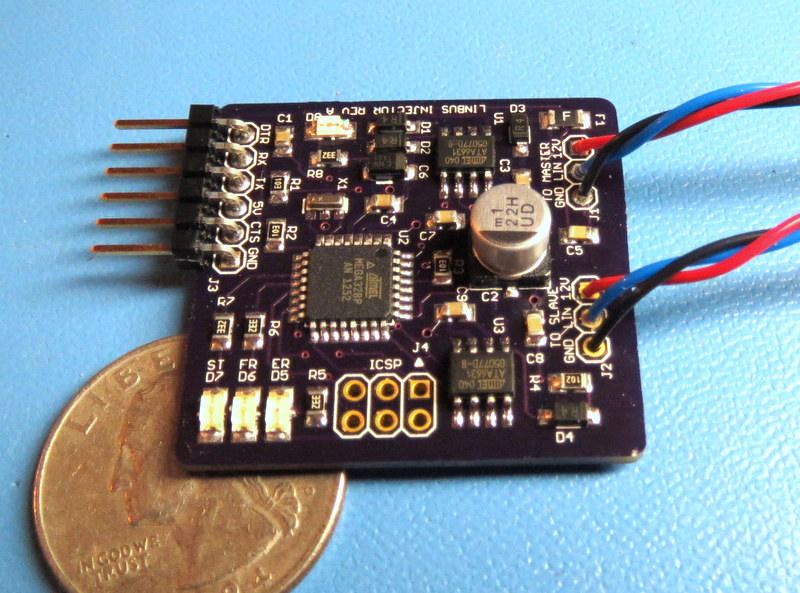

Arduino LINBUS Signal Injector
==============================

The Arduino Linbus injector is a small Arduino based board that connects on a LIN bus between the master and a slave
and can observe and manipulate the data flowing on the bus. It also has a 115kbs serial interface  programming and for logging bus activity on a standard computer (a serial to FTDI USB adapter such as Sparkfun FTDI Basic is required).

The board has two LIN bus ports, one that acts as a slave and should be connected to the LIN bus master and another
 that acts as a master and should be connected to the LIN bus slace. The firmware here includes a set of files named
with the prefix custom_ that implement an application specific logic (simulating pressing the Sport Mode button of my
car whenever the ignition is turned) and should be modified to match the target logic and behavior.

The USB/Serial port is also compatible with the Arduino IDE (emulating an Arduino Mini Pro 16Mhz 5V with Atmega328p) which can be used to edit/compile/download software updates. 

The serial output of the injector can be viewed directly with a terminal emulation software or using the provided script that adds timestamp and bit by bit diff capabilities (see the [serial tool](../tools/serial)).

The injector provided sample application is configured for 19,200bps linbus that uses LIN V2 checksum but be configured 
for busses with different speeds and checksum formula.

